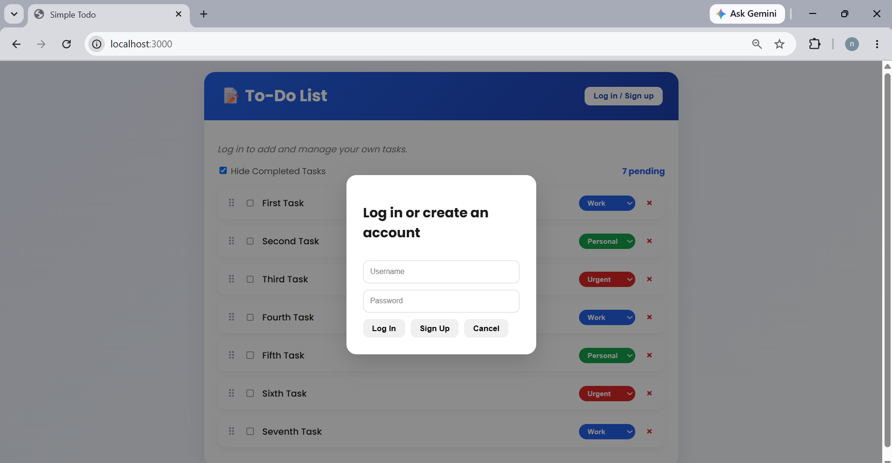
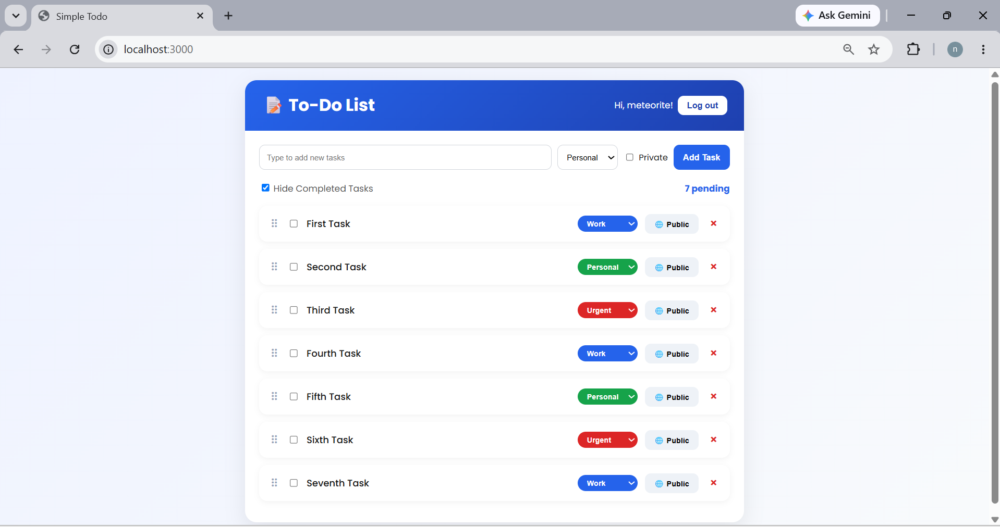
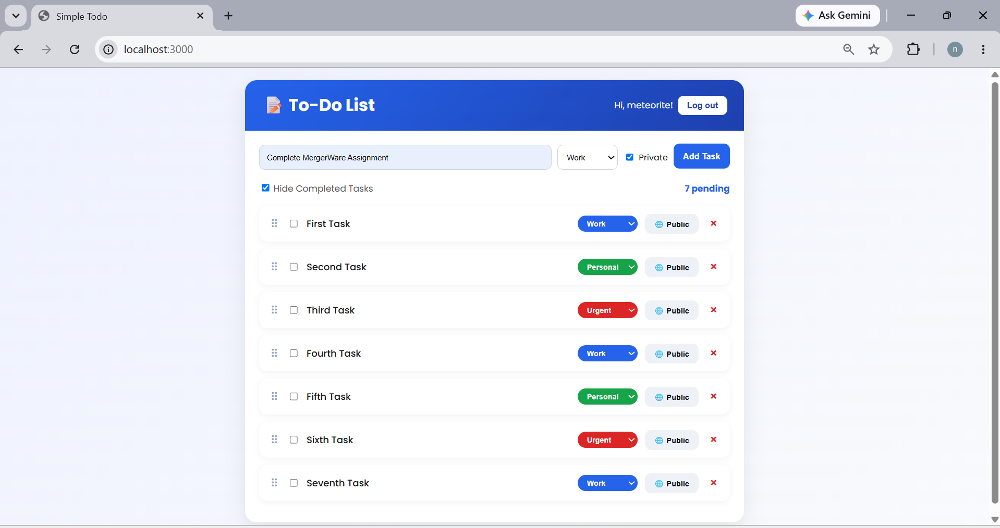
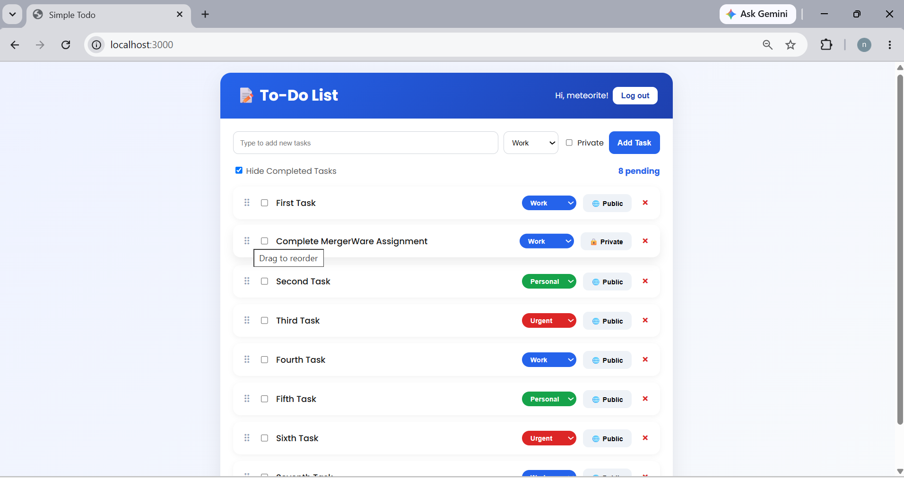

# Simple Todos — Meteor + Blaze (MergerWare Assessment)

This is the official [Meteor Blaze "Simple Todos" tutorial](https://blaze-tutorial.meteor.com/simple-todos/)
app, built out through every step (collections, forms/events, update &
remove, styling, filtering, user accounts, server-side Methods, and
publications), plus the two enhancements required by the MergerWare
Software Engineering Intern assessment:

1. **Task Categories** — tasks can be tagged `Work`, `Personal`, or
   `Urgent`, set on creation and changeable later from a colored
   dropdown on each task.
2. **Drag-and-Drop Reordering** — tasks can be reordered by dragging
   them by the handle on the left; the new order is persisted to MongoDB.

## Prerequisites

- Node.js 20+ (`node -v` to check)
- Meteor CLI installed:
  - Mac/Linux: `curl https://install.meteor.com/ | sh`
  - Windows: `npm install -g meteor`

## Running the app

```bash
git clone <this-repo-url>
cd simple-todos-blaze
meteor npm install
meteor run
```

Then open `http://localhost:3000`. The server seeds a demo user the
first time it runs:

- username: `meteorite`
- password: `password`

You can also click **Log in / Sign up** and create your own account —
Sign Up creates a brand-new account with the username/password you type.

## Project structure

```
client/
  main.html        # <head> only; <body> lives in App.html
  main.js          # imports the UI entry point
  main.css         # all styling
server/
  main.js          # startup seed data, imports methods & publications
imports/
  api/
    TasksCollection.js     # Mongo.Collection definition + schema docs
    tasksMethods.js        # all server-side Methods (insert/remove/etc.)
    tasksPublications.js   # publishes only tasks the user is allowed to see
  ui/
    App.html / App.js          # top-level template, task list + filter
    LoginButtons.js            # login/logout buttons in header
    LoginForm.js                # login/signup overlay form
    TaskForm.js                  # add-task form (text, category, private)
    Task.js                       # per-task logic (check, delete, category)
    DragDrop.js                    # SortableJS wiring for reordering
```

## How the two required features work

### Task Categories

- Each task document has a `category` field (`Work`, `Personal`, or
  `Urgent`), validated server-side in `tasksMethods.js` against the
  `TASK_CATEGORIES` whitelist.
- When adding a task, the `taskForm` template includes a `<select>` for
  category, sent to the `tasks.insert` Method.
- Each existing task shows a colored `<select>` (color comes from CSS
  classes `category-Work` / `category-Personal` / `category-Urgent`)
  that calls the `tasks.setCategory` Method on change.

### Drag-and-Drop Reordering

- Each task document has a numeric `order` field used to sort the list
  (`tasksPublications.js` publishes tasks sorted by `order`).
- The list (`#tasks-list`) is wired up with [SortableJS](https://sortablejs.github.io/Sortable/)
  in `DragDrop.js`, restricted to drags started from the `.drag-handle`
  element so clicking elsewhere on a task doesn't start a drag.
- On drop, the client reads the resulting DOM order of task IDs and
  calls the `tasks.reorder` Method, which rewrites each task's `order`
  field to match its new position.
- New tasks are inserted with an `order` lower than the current
  minimum, so they always appear at the top of the list.

> Note: reordering is based on the currently *visible* list. If "Hide
> Completed Tasks" is checked, only visible tasks are involved in a
> given drag-and-drop operation; completed tasks keep their relative
> order among themselves.

## Security model

Per the later tutorial steps, the client does **not** have direct
write access to the `tasks` collection (the `insecure` and
`autopublish` packages are intentionally left out of
`.meteor/packages`). All writes go through validated server-side
Methods in `imports/api/tasksMethods.js`, and only the data each user
is allowed to see is sent to them via the `tasks` publication in
`imports/api/tasksPublications.js`.

## Possible next steps

- Add per-category filtering (in addition to hide-completed).
- Persist a separate `order` per filtered view instead of one global
  order field.
- Add Meteor tests (`meteor test --driver-package meteortesting:mocha`).
## Screenshots

## Screenshots

### Login Page


### Dashboard


### Add Task


### Task Categories


### Drag-and-Drop Reordering


### Mobile Responsive View
